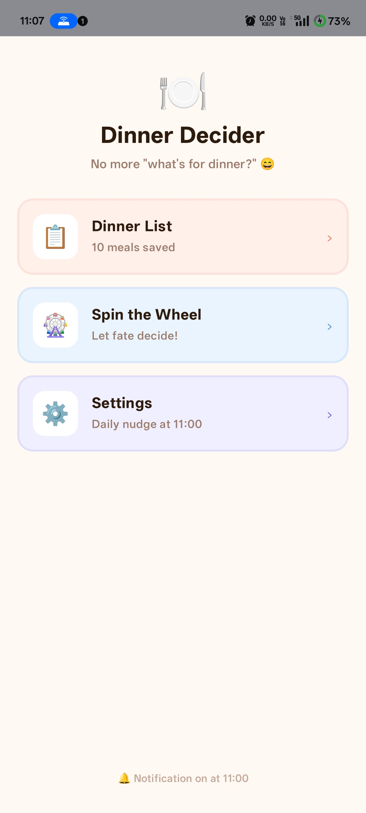
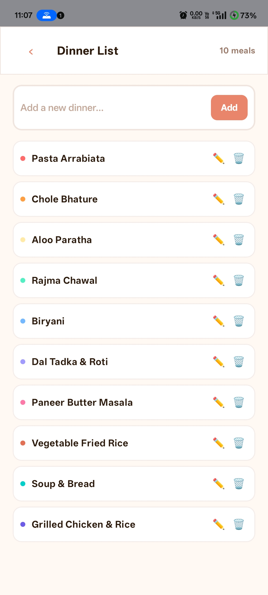
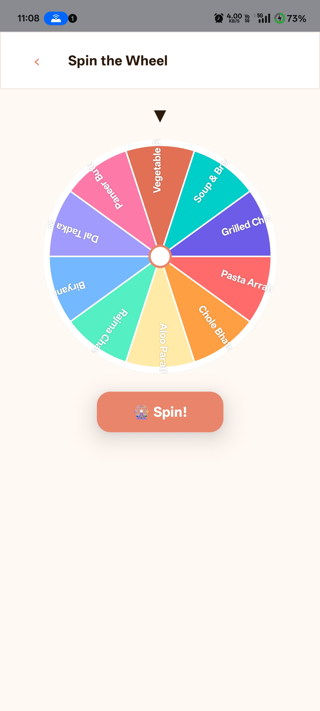
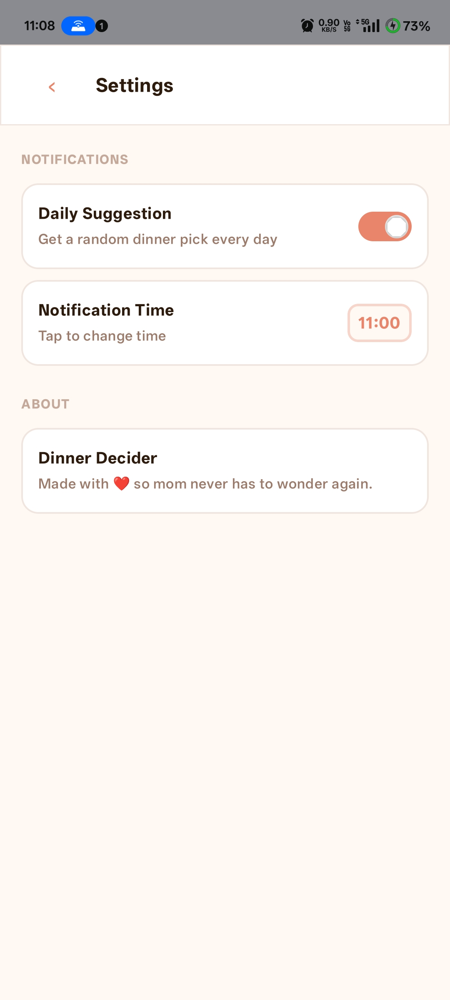

# 🍽️ Dinner Decider

<p align="center">
  <b>Never ask “What’s for dinner?” again.</b><br/>
  A simple, fun, and beautiful Android app to help you decide your next meal.
</p>

<p align="center">
  
  
  
  
</p>

---

## ✨ Features

* 📋 **Smart Dinner List**
  Add, edit, and organize your favorite meals

* 🎡 **Spin Wheel Picker**
  Randomly choose dinner in a fun, interactive way

* 🔔 **Daily Notifications**
  Get automatic dinner suggestions at your chosen time

* 🎨 **Modern UI**
  Built with Material 3 for a clean and warm experience

* 💾 **Auto Save**
  Your data persists seamlessly

---

## 📱 Screenshots

<p align="center">
  
  
  
  
</p>

---

## 🚀 Download

<p align="center">
  <a href="https://github.com/mdskun/dinner-decider/releases">
    
  </a>
</p>

---

## 🛠️ Tech Stack

| Technology      | Purpose                   |
| --------------- | ------------------------- |
| Kotlin          | Core programming language |
| Jetpack Compose | UI development            |
| Material 3      | Design system             |
| AndroidX        | Core libraries            |

---

## 📋 Requirements

* Android 8.0 (Oreo) or higher
* Internet (only for initial download)

---

## 🏗️ Build from Source

```bash
git clone https://github.com/Mdskun/dinner-decider.git
cd dinner-decider
./gradlew assembleDebug
```

> Open the project in **Android Studio Hedgehog or newer**

---

## 🎯 Usage

1. Add your meals in **Dinner List**
2. Spin the wheel 🎡
3. Set a daily reminder 🔔
4. Enjoy stress-free decisions 🍽️

---

## 🔔 Notification Tips

To ensure notifications work reliably:

* Allow notification permission ✅

**Device-specific:**

* **Xiaomi / Redmi** → Enable *Autostart*
* **Samsung** → Disable battery optimization
* **OnePlus / OPPO** → Lock app in recent apps

---

## 📄 License

This project is licensed under the **MIT License**
See the [LICENSE](LICENSE) file for details.

---

## 👨‍💻 Author

**Mdskun**
🔗 [https://github.com/mdskun](https://github.com/mdskun)

---

## 🌟 Support

If you like this project:

* ⭐ Star the repo
* 🐛 Report issues
* 💡 Suggest features

---

## 📝 Changelog

### v1.0.1

* Initial release
* Dinner list management
* Spin wheel with animations
* Daily notifications
* Material 3 UI
* Status bar fix
* App icon added

---

## ❤️ Special Note

> Made with ❤️ for everyone tired of deciding dinner.
> And especially for **Mom** — who’s tired of asking *“What should I cook?”* 🍲

